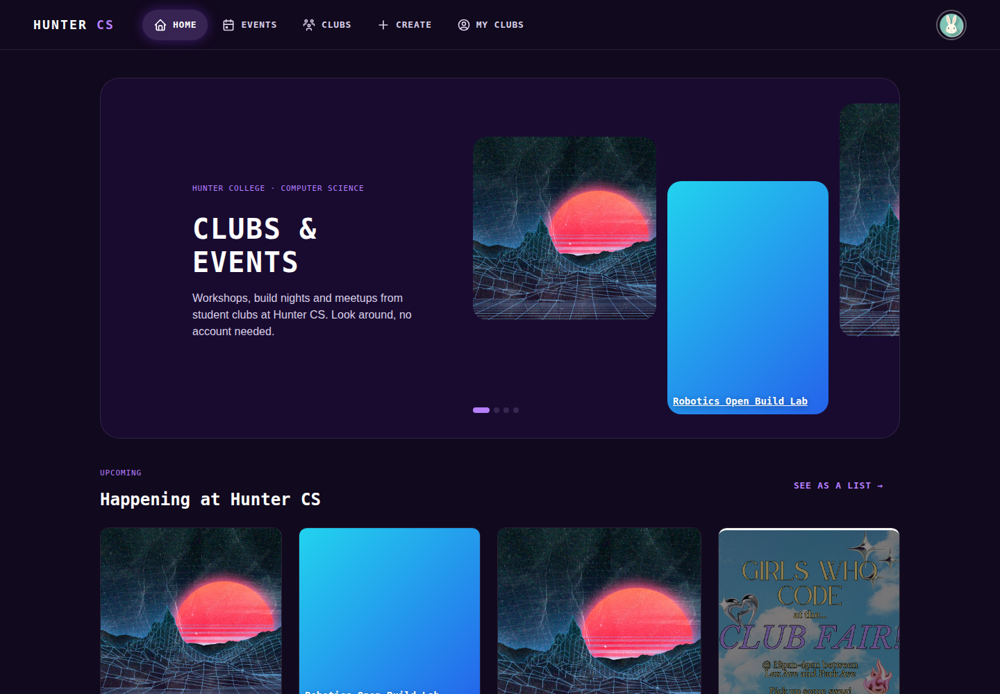
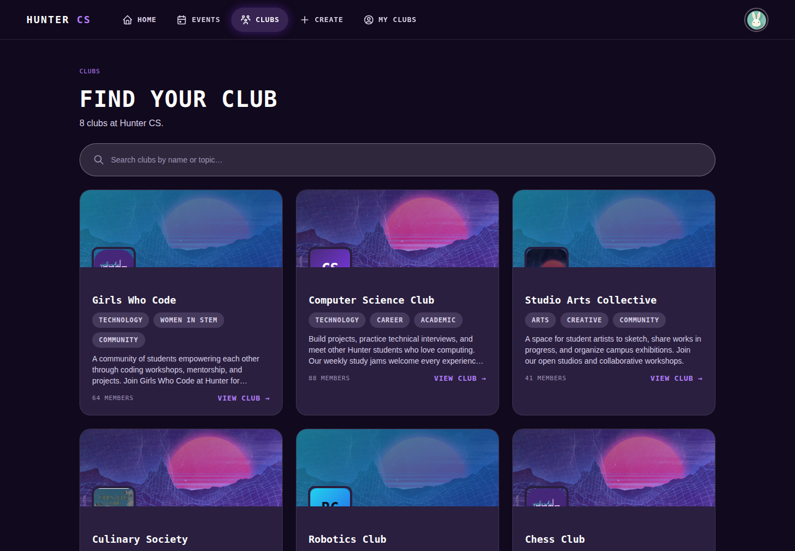
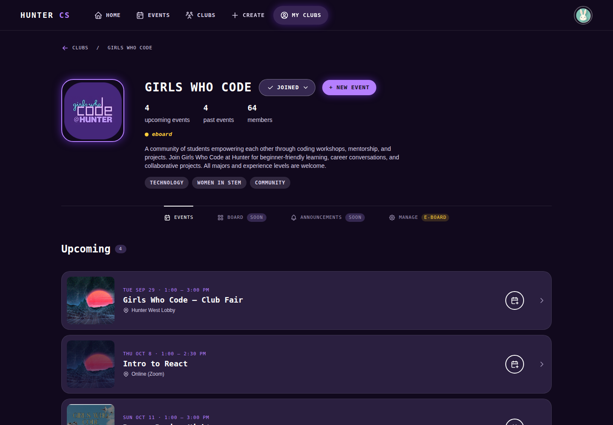
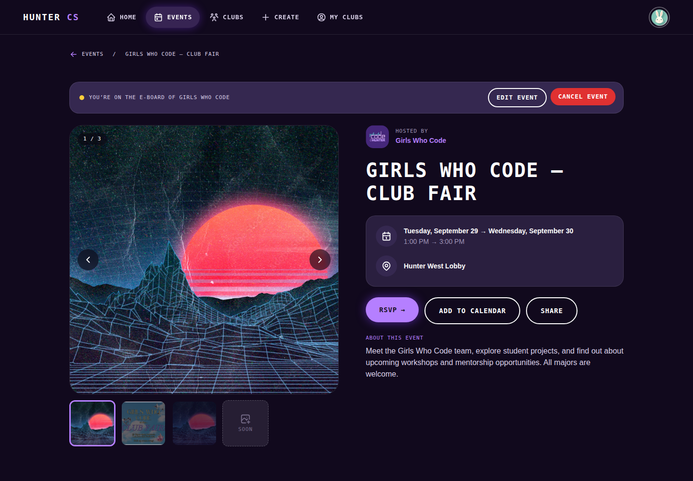
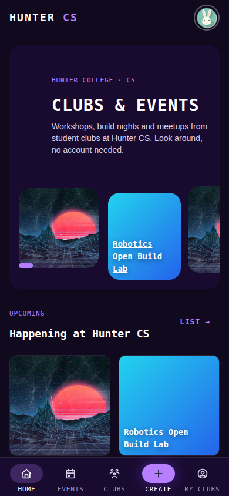

# Hunter College Clubs Frontend

A home base for student clubs at Hunter College Computer Science: one place to see what clubs
exist, what they're doing, and what's coming up.

- **Browsing:** anyone — no account needed — can look through the clubs on campus and see
  what events they're running, from workshops to socials to build nights.
- **For clubs:** club leaders can give their club a page (with a logo, description, and
  topics), post photos and details for their events, and manage who's helping run things.
- **For members:** sign in to join clubs, keep track of the ones you're part of, and see
  everything they have coming up in one place.

## Preview

The screenshots below are from the current design, running against **mock/demo data** — not a
live club directory. They're a preview of the interface, not real Hunter CS clubs or events.

**Home** — upcoming events from every club, at a glance


**Clubs** — browse and search every club on campus


**Club page** — a club's own page: who's on it, what they're hosting, and how to join


**Event page** — the details for one event, with RSVP, calendar, and sharing


<details>
<summary>Mobile view</summary>



</details>

## Running it yourself

The quickest way to try it out uses mock data, so no backend or account setup is needed:

```bash
npm ci
VITE_USE_MOCK_API=true npm run dev:mock -- --host 127.0.0.1 --port 5173 --strictPort
```

Then open **http://127.0.0.1:5173/**. See **[docs/design-mode.md](docs/design-mode.md)** for
what you can click through in that mode, and **[docs/setup.md](docs/setup.md)** for running it
against a real backend instead.

## What's in this repo, technically

This is the frontend only — a React + TypeScript app (Vite, React Router, Mantine UI) that talks
to a separate backend API over `fetch`, and to AWS Cognito for sign-in. It doesn't store any
data itself; **club and event data comes from that backend**, which is developed in a different
repository and is still being built out. Until it's ready, the mock mode shown above stands in
for it, so the interface can be built and tried without waiting on it.

The `docs/` folder has the details, if you're working on this code:

- **[docs/pages.md](docs/pages.md)** — every screen, route by route
- **[docs/components.md](docs/components.md)** — the reusable UI pieces and where they live
- **[docs/api.md](docs/api.md)** — the exact endpoints the frontend expects from the backend
- **[docs/design-mode.md](docs/design-mode.md)** — running with mock data, in depth
- **[docs/setup.md](docs/setup.md)** — running against a real backend
- **[docs/overview.md](docs/overview.md)** — how the code is organized and how staging deploys

## Contributing
- Keep route-level fetching and wiring in `src/pages/`.
- Keep reusable UI in `src/components/`.
- Prefer typed helpers in `src/types/` for API payload normalization.
- When changing routes or API calls, update the docs in `/docs`.
