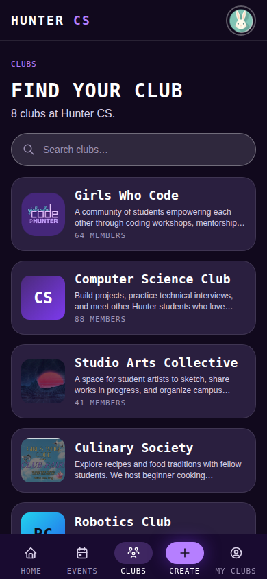
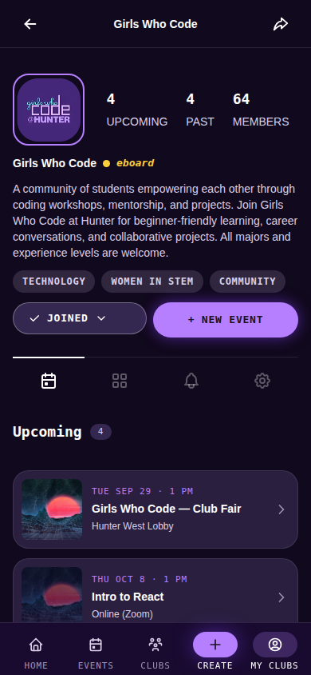
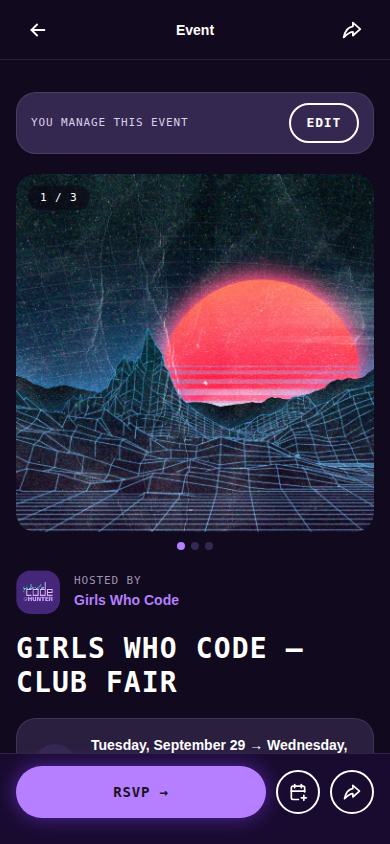

# Hunter College Clubs Frontend

A home base for student clubs at Hunter College Computer Science: one place to see what clubs
exist, what they're doing, and what's coming up.

Anyone can browse without an account, looking through the clubs on campus and seeing what
events they're running, from workshops to socials to build nights. Club leaders can give their
club a page, post photos and details for their events, and manage who's helping run things.
Members can sign in to join clubs, keep track of the ones they're part of, and see everything
those clubs have coming up in one place.

## Preview

The screenshots below are from the current design, running on mock/demo data rather than a live
club directory. They're a preview of the interface, not real Hunter CS clubs or events. See
[docs/design-mode.md](docs/design-mode.md) to run it yourself and try it out.

### Home
Upcoming events from every club, at a glance.

| Desktop | Mobile |
| --- | --- |
|  |  |

### Clubs
Browse and search every club on campus.

| Desktop | Mobile |
| --- | --- |
|  |  |

### Club page
A club's own page: who's on it, what they're hosting, and how to join.

| Desktop | Mobile |
| --- | --- |
|  |  |

### Event page
The details for one event, with RSVP, calendar, and sharing.

| Desktop | Mobile |
| --- | --- |
|  |  |

## About this repository

This repo is the frontend only. It's a React and TypeScript app that talks to a separate backend
API for club and event data, and to AWS Cognito for sign-in. The backend is being developed in
a different repository and isn't finished yet, so this frontend also has a mock mode that stands
in for it with sample data, which is what the screenshots above were taken from.

The `docs/` folder has more detail for anyone working on the code:

- [docs/setup.md](docs/setup.md) - running the app locally, including against a real backend
- [docs/design-mode.md](docs/design-mode.md) - running it with mock data instead
- [docs/pages.md](docs/pages.md) - every screen, route by route
- [docs/components.md](docs/components.md) - the reusable UI pieces and where they live
- [docs/api.md](docs/api.md) - the endpoints the frontend expects from the backend
- [docs/overview.md](docs/overview.md) - how the code is organized and how staging deploys

## Contributors

- [Kyle Bautista](https://github.com/KymaiselHunter)
- [Maliha Tasnim](https://github.com/MalihaT111)
- [Michael Wong](https://github.com/michaelwong3049)
- [Lena Ngo](https://github.com/lenan14)
- Kelly Lin, Designer
